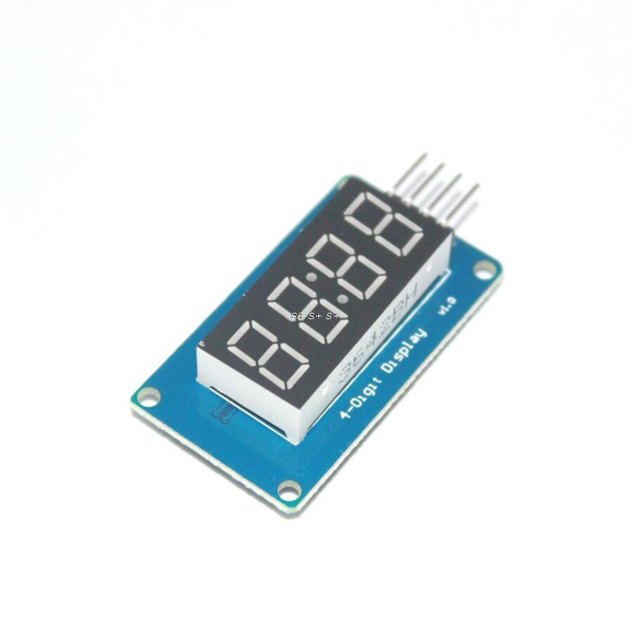
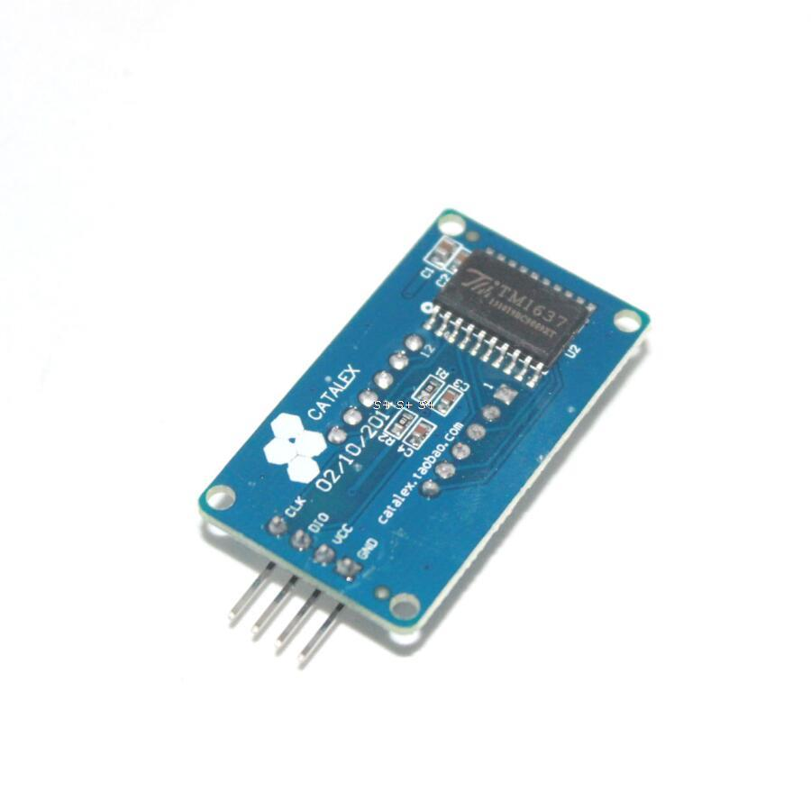

tm1637.py is a driver library; 
display.py shows its use

code can be used on similar modules like in the images

#Pins connection
| Board Pin | Name | Remarks     | RPi Pin | RPi Function      |
|----------:|:-----|:------------|--------:|-------------------|
| 1         | GND  | Ground      | 2       | 5V0               |
| 2         | VCC  | +5V Power   | 6       | GND               |
| 3         | DIN  | Data In     | 18      | GPIO 24           |
| 4         | CLK  | Clock       | 16      | GPIO 23           |
 

 

